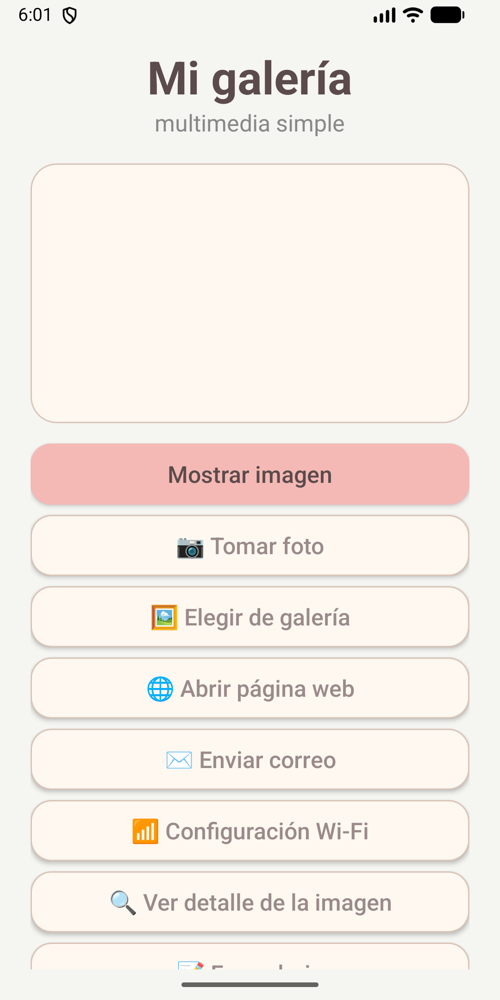
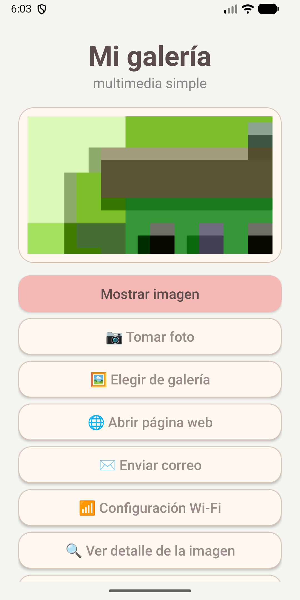
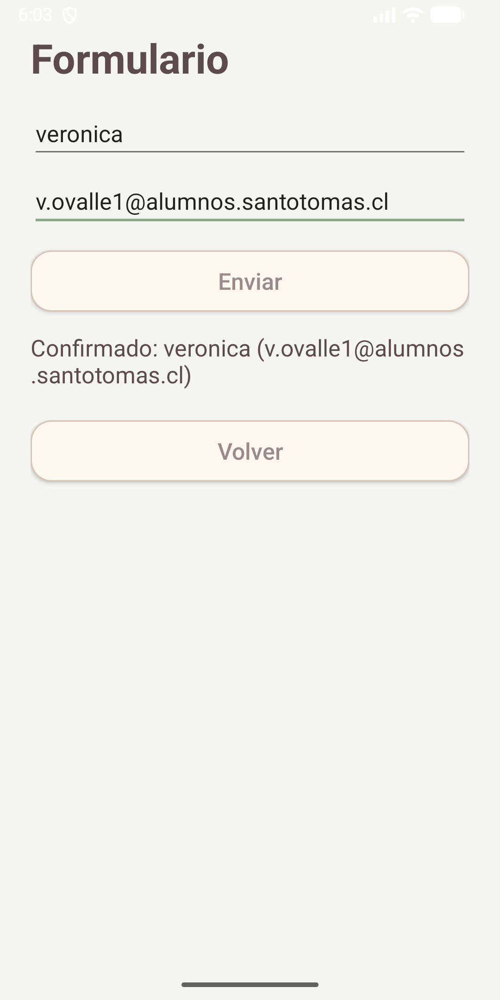
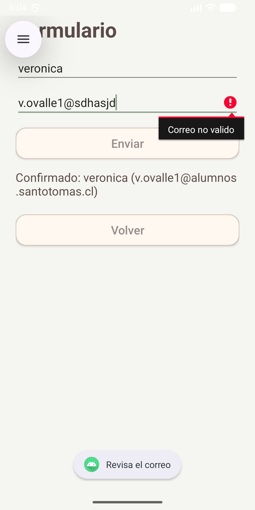
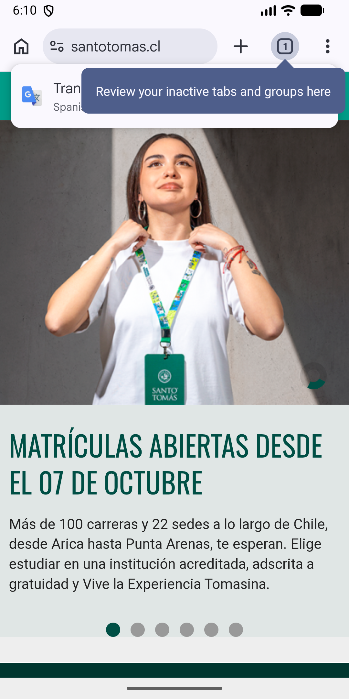
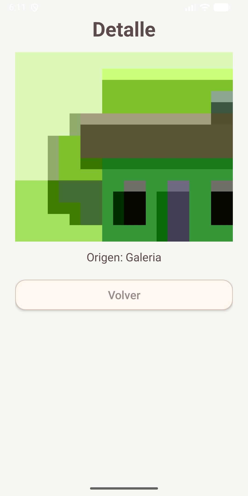
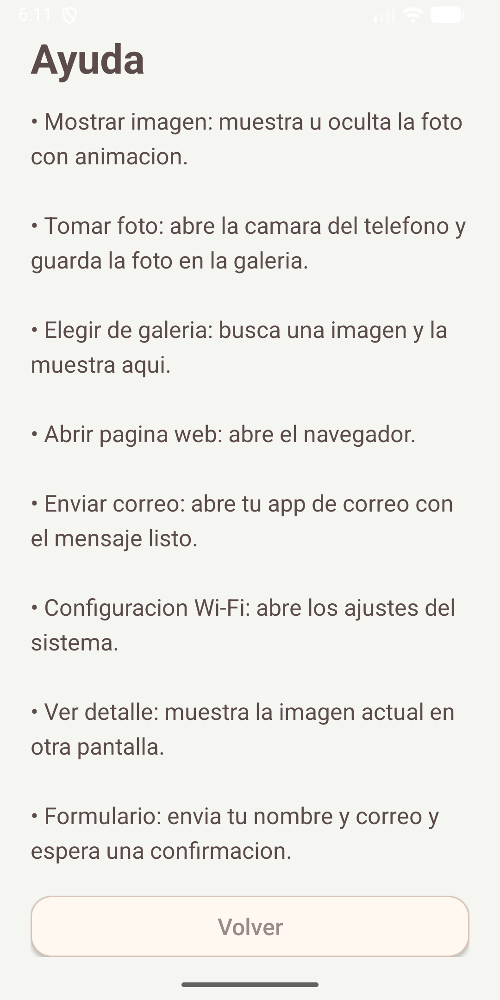
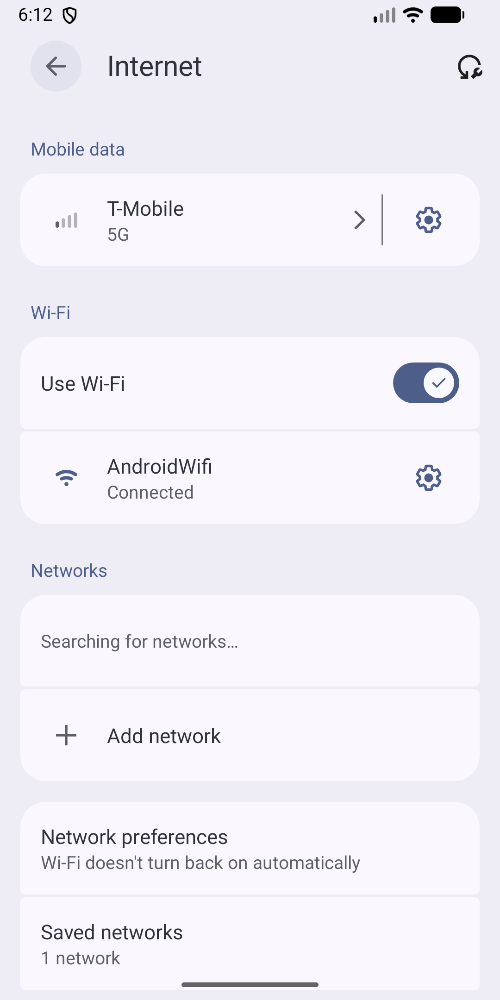

# 📱 AppVoz – Prototipo 2

App Android en **Java** que integra intents implícitos y explícitos, validaciones y uso de Threads.

## ℹ️ Datos del proyecto
- 🎓 Asignatura: Programación Android – Prototipo 2
- 👥 Equipo: Veronica Ovalle - Sheriet Ramos
- 🤖 minSdk 24 · targetSdk/compileSdk 36
- 🔧 Android Gradle Plugin: - 🔧 Android Gradle Plugin (AGP): 9.0.1 · Gradle 9.2.1
- 💻 Lenguaje: Java 11

## ✅ Intents implementados

### 🌍 Implícitos (5)
| # | Intent | Acción | Cómo probarlo |
|---|--------|--------|---------------|
| 1 | 📷 Cámara | `MediaStore.ACTION_IMAGE_CAPTURE` | Tocar "Tomar foto" → aceptar permiso → tomar foto → se ve en pantalla y queda en la galería |
| 2 | 🖼️ Galería | `ACTION_GET_CONTENT` (`image/*`) | Tocar "Elegir de galería" → elegir imagen → se muestra |
| 3 | 🌐 Web | `ACTION_VIEW` con `https://` | Tocar "Abrir página web" → abre el navegador |
| 4 | ✉️ Correo | `ACTION_SENDTO` con `mailto:` | Tocar "Enviar correo" → se abre con asunto y cuerpo prellenados |
| 5 | 📶 Wi-Fi | `Settings.ACTION_WIFI_SETTINGS` | Tocar "Configuración Wi-Fi" → abre los ajustes |

### 🧭 Explícitos (3)
| # | Intent | Cómo probarlo |
|---|--------|---------------|
| 1 | `MainActivity → DetalleActivity` (con extras y URI) | Elegir foto → "Ver detalle de la imagen" |
| 2 | `FormActivity → ConfirmActivity` (con `registerForActivityResult`) | "Formulario" → llenar nombre y correo → Enviar → Confirmar |
| 3 | `MainActivity → AyudaActivity` | Tocar "Ayuda" |

## 🛡️ Validaciones
- Permisos de cámara y galería antes de usarlos
- Comprobación de `ActivityNotFoundException` en todos los intents implícitos
- Resultados `RESULT_OK` y datos no nulos
- Campos del formulario (nombre vacío y correo con formato válido)
- Imágenes cargadas en un `Thread` aparte con `runOnUiThread`

## 📸 Capturas

## ▶️ Cómo compilar
1. Abrir el proyecto en Android Studio
2. Esperar la sincronización de Gradle
3. Ejecutar ▶ en un emulador o dispositivo
4. APK debug: `app/build/outputs/apk/debug/app-debug.apk`
   (Build → Build APK(s))

